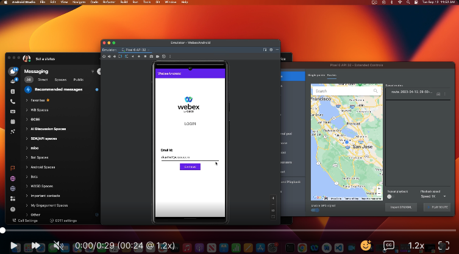

<!-- # Repo-Template
This is an Internal WXSD Template to be used for GitHub Repos moving forward. Follow the following steps: Visit https://github.com/wxsd-sales/readme-template/blob/master/README.md for extended details.
-->


<!--   Step 1) Name your repository: Names will ALWAYS start with "bot - ", "integration -", "macro -", or "supportapp -" 
Examples:"bot- <insert repo name>" 
       "integration - <insert repo name>"
       "macro - <insert repo name>"
       "supportapp - <insert repo name>" 

~3 words, kebab case, use words to indicate what it does. Visit https://github.com/wxsd-sales/readme-template/blob/master/README.md for details  
-->

<!--  Step 2) Add One sentence description to your repository: Copy/Paste from Webex Labs Card sentence.
       Example: "Redirect an Auto Attendant caller to an SMS conversation to alleviate Call Queue Agent responsibilities."
-->

<!--  Step 3) Use following Template to copy/paste your details below -->

# Speed Tracking Android App
 
This demo provides an illustration on how the android app can be blocked from usage while driving and also set the Webex status of the driver to Donot Disturb and custom status to Driving.

In this application, we use the SDK to retrieve details about the logged in user, extract all the direct contacts of that user, and use messaging and meeting features to engage with their contacts. This application also demonstrates how to add meeting controls like muting the audio, muting the video, screen sharing, speaker mode, holding the call etc. You can also login and logout of the app using OAuth webview.  

[](https://app.vidcast.io/share/27203b80-3443-4b7c-bfb2-44c1fb15d463, "Android SDK Demo App")

<!-- Keep the following here -->  
 *_Everything included is for demo and Proof of Concept purposes only. Your use of the site is solely at your own risk. This site may contain links to third party content, which we do not warrant, endorse, or assume liability for. These demos are for Cisco Webex usecases, but are not Official Cisco Webex Branded demos._


## Setup

### Prerequisites: The following instructions assume that you have:

- Mobile Integration with valid client ID and client secret. Please refer [Webex Developer Site](https://developer.webex.com/docs/integrations#registering-your-integration) to see how to register your integration.


<!-- GETTING STARTED -->

### Installation Steps:
1.  Download or clone this git project and open it in your android studio IDE
2.  Include all these constants in your gradle.properties file
    ```
    CLIENT_ID=""
    CLIENT_SECRET=""
    SCOPE=""
    REDIRECT_URI=""
    ```
3.  Run this project on android emulator or on local device
